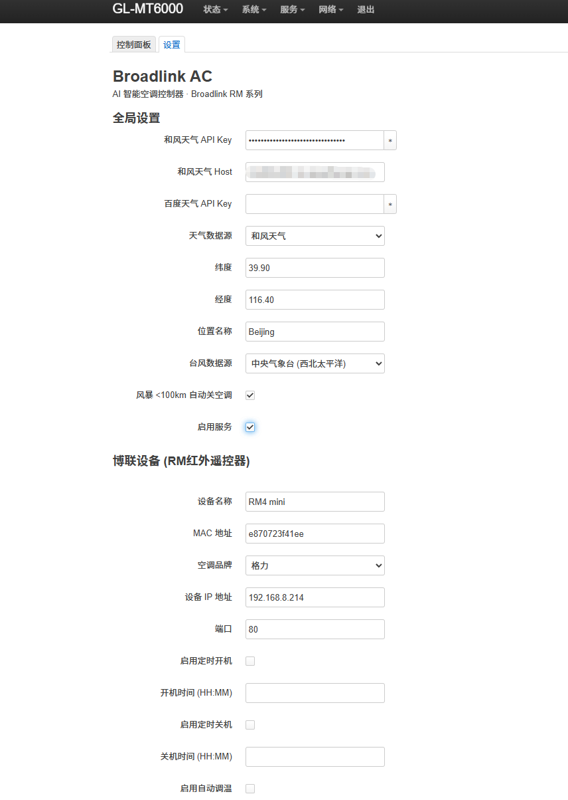
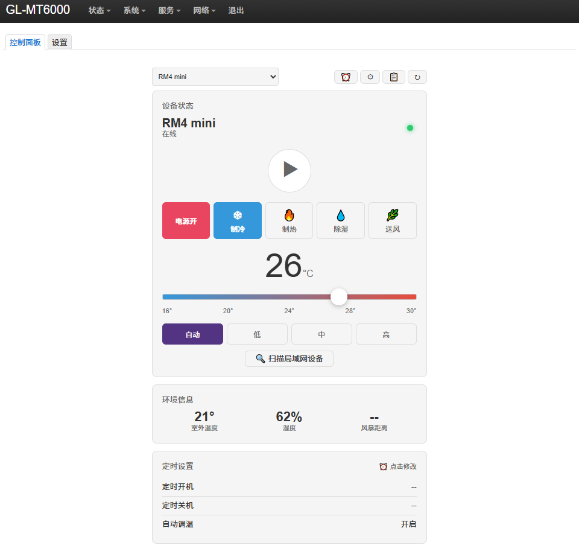

# BroadlinkAC-OpenWRT

The Broadlink fully automatic air conditioning control plugin for OpenWRT routers automatically acquires weather data, enabling the router to automatically manage and adjust the air conditioning and temperature around the clock.

[](LICENSE)
[]()
[]()


## ✨ Features

- 🎛️ **LuCI control panel** — Web UI for AC control, device config, log viewing
- 🌤️ **Dual weather source** — Baidu + QWeather, automatic fallback + stale-cache rescue
- 🌀 **Typhoon auto-protection** — Force-shutdown all ACs when storm < 100km (coastal-user safety design)
- ⏰ **Scheduling + auto-adjust** — 2h relative interval + fixed-time on/off
- 🛡️ **procd daemon** — System service supervision + boot auto-start + exception fallback
- 📥 **Log download** — 14-day date grid + Markdown file download
- 🔌 **UCI bidirectional sync** — CBI settings ↔ config.json auto-sync

## 🚀 Quick Start

### 1. Download IPK

Grab the latest `.ipk` from [Releases](https://github.com/oywq00008-cell/BroadlinkAC-OpenWRT/releases):

```bash
scp broadlinkac_3.1-1_*.ipk root@192.168.1.1:/tmp/
ssh root@192.168.1.1
opkg install /tmp/broadlinkac_3.1-1_*.ipk
```

### 2. Open LuCI Control Panel

Navigate to: `http://192.168.1.1/cgi-bin/luci/admin/services/broadlinkac`

### 3. Configure API Key

**Services → Broadlink AC Control → Settings**:
- Baidu Weather API Key (apply [here](https://lbsyun.baidu.com/apiconsole/key)) — recommended
- QWeather API Key + Host (apply [here](https://dev.qweather.com/)) — fallback
- free!

### 4. Scan LAN Devices

In the control panel, click `⚙️ Device Settings → 🔄 Scan Devices` to auto-discover Broadlink RM devices.

## 🛠️ Compatibility

| Item | Supported Version |
|------|-------------------|
| OpenWRT | 21.02+ |
| Python | 3.8+ |
| LuCI | 19.07+ |
| Broadlink devices | RM Mini 3 / RM4 Mini / RM Pro+ |
| Architecture | aarch64 / armv7 / x86_64 |

## 📦 Manual IPK Build

```bash
cd ipk-build
python3 build_ipk.py
# Output: broadlinkac_3.1-1_<arch>.ipk
```

## 🔧 Dev Mode (Push Code to Router)

```bash
# After editing code, push to router via paramiko stdin pipe
python router_sync.py
```

> Note: OpenWrt dropbear does NOT support SFTP, you MUST use stdin pipe.

## 📁 Directory Structure

```
broadlinkac/
├── files/
│   ├── etc/
│   │   ├── config/broadlinkac          # UCI default config
│   │   ├── init.d/broadlinkac          # procd daemon
│   │   └── uci-defaults/99-broadlinkac # First-boot setup script
│   └── usr/
│       ├── lib/broadlinkac/            # Python core + protocols
│       │   ├── broadlinkac_core/
│       │   │   ├── ac_control.py
│       │   │   ├── config.py
│       │   │   ├── logger.py
│       │   │   ├── scheduler.py
│       │   │   ├── typhoon.py
│       │   │   └── weather.py
│       │   ├── protocols/              # Custom IR protocols
│       │   │   ├── haier.py
│       │   │   ├── aux_ac.py
│       │   │   └── panasonic.py
│       │   ├── broadlinkac_api.py      # LuCI-callable CLI
│       │   └── broadlinkac_service.py  # procd backend daemon
│       └── lib/lua/luci/               # LuCI views
│           ├── controller/broadlinkac.lua
│           ├── model/cbi/broadlinkac.lua
│           └── view/broadlinkac/dashboard.htm
├── Makefile                            # IPK build metadata
└── ipk-build/build_ipk.py              # Build script
```

## 🔗 Sister Project

**Desktop app and Agent**: [BroadlinkAC-For-Agent](https://github.com/oywq00008-cell/BroadlinkAC-For-Agent)
- Cross-platform desktop GUI (Windows / macOS / Linux)
- AI Agent Skill interface
- More features, better experience, highly recommended!

**Router app (this repo)**:
- 24/7 headless operation
- Weather/typhoon auto-response
- Perfect for "install and forget" home setups

Both projects **share core algorithms** (ac_control / typhoon / weather / scheduler) but **evolve independently** — the router side focuses on "safety first + graceful degradation", the desktop side focuses on "user config + interactive popups".

## 📝 License

MIT — see [LICENSE](LICENSE)

## 🙏 Acknowledgments

- IR protocols based on [python-broadlink](https://github.com/mjg59/python-broadlink) and [hvac_ir](https://github.com/nicko858/hvac_ir)
- Weather data from Baidu Maps Open Platform + QWeather
- Typhoon data from [NMC](http://www.nmc.cn) / [NHC](https://www.nhc.noaa.gov/)
